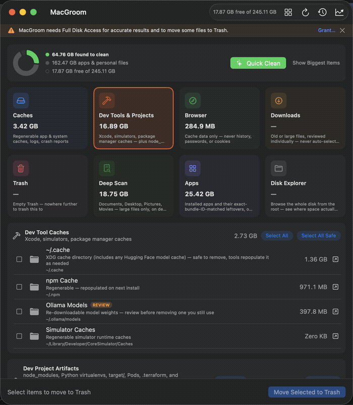

# macgroom

Free dev-cache cleanup, from the terminal — the open-source CLI companion to [MacGroom](https://gogenops.com/mac-apps/macgroom/), a native macOS disk-cleanup app.

Finds and (optionally, safely) clears three categories that pile up fastest on a developer Mac:

- **Local AI model caches** — Ollama (`~/.ollama/models`), LM Studio (`~/.lmstudio/models`), and Hugging Face (`~/.cache/huggingface`) each keep their own separate copy of the same checkpoint, and none of them clean up after themselves. Comparing even a handful of local models routinely means 50–150GB of duplicate, forgotten weights — the fastest-growing bucket on a 2026 dev machine. Every one is flagged for review (`!` in `scan`, excluded from `--yes` unless you pass `--include-review`) — re-downloadable, but you might still be using it.
- **Dev Tool Caches** — Xcode DerivedData, Simulator Caches, and npm/Yarn/pnpm/pip/Poetry/Cargo caches.
- **Dev Project Artifacts** — `node_modules`, Python virtualenvs, Rust/Maven `target/`, CocoaPods `Pods/`, `.terraform`, and Next.js/Nuxt build caches, found **recursively** across every project under a given path.

Pure Swift, zero third-party dependencies, no telemetry, nothing ever leaves your Mac. Every deletion goes through macOS's own Trash — recoverable until you empty it, never `rm`.

## Demo: the safety model, end to end

A real Ollama model pulled onto a real Mac, flagged for review by the MacGroom app (never auto-selected — you might still be using it), cleaned deliberately through the GUI, then confirmed gone with this CLI:



```
$ macgroom scan
!  397.8 MB   Ollama Models
     /Users/…/.ollama/models
...
$ # cleaned via the MacGroom app — moved to Trash, not rm'd
$ macgroom scan
# Ollama Models no longer listed — /Users/…/.ollama/models is gone
```

Same underlying scan logic, same `!`-for-review gating, same Trash-not-`rm` safety model in both the CLI and the GUI app — this is that consistency, not a mockup.

## Install

```bash
brew install soodrajesh/macgroom/macgroom
```

Or build from source:

```bash
git clone https://github.com/soodrajesh/macgroom-cli.git
cd macgroom-cli
swift build -c release
cp .build/release/macgroom /usr/local/bin/
```

## Usage

```bash
# List everything found under $HOME, with sizes — nothing is touched
macgroom scan

# Scope the recursive project scan to a specific directory (faster)
macgroom scan --path ~/Developer

# Machine-readable output
macgroom scan --json

# Interactive: review each item, y/n/a(ll)/q(uit)
macgroom clean

# Non-interactive: trash every *safe* item without asking
macgroom clean --yes

# See exactly what --yes would do, without doing it
macgroom clean --yes --dry-run

# Also include AI model caches (Ollama/LM Studio/Hugging Face) in
# --yes mode — excluded by default since you may still be using one
macgroom clean --yes --include-review
```

## Safety model

Same principle as the GUI app: **every deletion goes through Trash**, and nothing is ever auto-selected that isn't safely regenerable. Dev Tool Caches and Dev Project Artifacts are fully rebuildable by the tool that made them (`npm install`, `cargo build`, etc.) — marked safe, included by `--yes`. Local AI model caches (Ollama, LM Studio, Hugging Face) are *technically* re-downloadable but you might still be actively using one, so they're always flagged for review (`!` in `scan` output) and excluded from `--yes` unless you pass `--include-review` — that holds even when Hugging Face's cache is sitting inside the otherwise-safe `~/.cache`.

## Relationship to the MacGroom app

This CLI covers the three categories above — free forever, matching what's free in the [MacGroom GUI app's](https://gogenops.com/mac-apps/macgroom/) own free tier. The GUI app additionally covers general System & App Caches, Browser Caches, Downloads, Trash, and an App Cleaner (free), plus Deep Scan, Storage Trend, and a menu bar widget (MacGroom Pro, one-time $24). This CLI doesn't gate anything — it's a standalone free tool, not a trial.

The GUI app itself is closed-source; this CLI is an independent, from-scratch, open-source implementation of the same underlying scan logic — see [License](#license).

## Issues & feature requests

[soodrajesh/macgroom-support](https://github.com/soodrajesh/macgroom-support/issues/new/choose)

## License

MIT — see [LICENSE](LICENSE).
